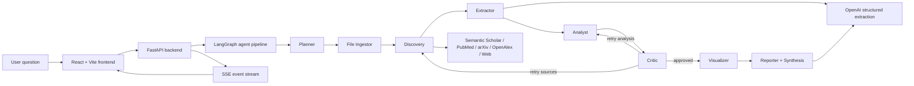

# DeepQuery

DeepQuery is a multi-agent research workspace that turns a research question into cited evidence, statistical analysis, visual summaries, and a decision-ready synthesis. It is built for researchers, students, analysts, and hackathon judges who need to see not only an answer, but also how that answer was produced and checked.

## Hackathon Summary

- **Project title:** DeepQuery
- **Team name:** DeepInsight
- **Track:** Agents Track
- **Repo:** https://github.com/aayushraj1425/DeepInsight
- **Local app URL:** http://127.0.0.1:5175/ when Vite falls back from `5174`
- **Backend URL:** http://127.0.0.1:8000

## What It Does

1. A user asks a research question.
2. A planner agent rewrites it into academic/search subqueries.
3. Discovery searches scholarly and public sources.
4. Extraction pulls numeric findings and exact source quotes.
5. Analysis aggregates, compares, and correlates findings.
6. A critic agent checks whether the results are grounded and relevant.
7. Visualization renders charts with significance and sample-size cues.
8. Reporting generates an executive summary, full markdown report, and source trace.

## Core Features

- Streaming multi-agent pipeline over Server-Sent Events.
- Cached demo runs for reliable hackathon demos.
- Live research mode using OpenAI plus public research APIs.
- Executive Summary card for direct decision support.
- Significance highlighting for `p < 0.05`.
- Sample-size weighting in visualizations.
- Clickable chart evidence trace that shows exact extracted source quotes.
- Upload support for PDF, CSV, and text files.

## Architecture



## Tech Stack

- **Frontend:** React, TypeScript, Vite, Tailwind CSS, D3, Lucide icons
- **Backend:** Python, FastAPI, LangGraph, Pydantic, Instructor, OpenAI API
- **Analysis:** pandas, NumPy, statsmodels
- **Visualization:** Plotly-style chart specs rendered with D3
- **Transport:** Server-Sent Events
- **External sources:** Semantic Scholar, PubMed, arXiv, OpenAlex, optional web search

## Quick Start

### 1. Backend

```bash
cd deepquery/backend
python3 -m venv .venv
source .venv/bin/activate
pip install -r requirements.txt
cp .env.example .env
```

Edit `deepquery/backend/.env`:

```bash
OPENAI_API_KEY=your_openai_api_key_here
```

Run the backend:

```bash
uvicorn main:app --host 127.0.0.1 --port 8000
```

Health check:

```bash
curl http://127.0.0.1:8000/api/health
```

### 2. Frontend

```bash
cd deepquery/frontend
npm install
npm run dev
```

Open the Vite URL. It usually starts at:

```text
http://127.0.0.1:5174/
```

If `5174` is occupied, Vite will fall back to the next available `517x` port.

## Reproduce The Demo

For a fast, reliable hackathon demo, use the cached demo queries. These bypass live source search and OpenAI calls while still streaming the full agent workflow.

Recommended demo query:

```text
GLP-1 effects on cognition
```

Other cached demo queries:

```text
Microplastics and gut microbiome
Vitamin D and depression
what is the effect of sleep deprivation on cognitive performance?
what are the economic effects of minimum wage increases?
```

Demo flow:

1. Open the frontend.
2. Click or type `GLP-1 effects on cognition`.
3. Show the agent pipeline streaming: planner, discovery, extractor, analyst, critic, visualizer, reporter.
4. Show the Executive Summary card.
5. Show the charts.
6. Click a chart bar/point to open Source Peek.
7. Show the full markdown report.

## Environment Variables

See [backend/.env.example](backend/.env.example).

Required for live OpenAI-powered research:

```bash
OPENAI_API_KEY=your_openai_api_key_here
```

Cached demo mode does not require OpenAI, but live arbitrary queries do.

## Data And Provenance

DeepQuery has two data paths:

- **Live mode:** pulls research metadata and abstracts from public APIs including Semantic Scholar, PubMed, arXiv, and OpenAlex. Where available, it tries open-access PDFs or PubMed Central text.
- **Cached demo mode:** uses hand-authored synthetic demo findings in [backend/demo_cache.py](backend/demo_cache.py). These cached examples are for reliable hackathon presentation and UI reproducibility, not a factual benchmark dataset.

Uploaded user files are parsed locally and stored in memory for the active session.

## Known Limitations

- Live runs can be slow because the system performs search, full-text fetching, LLM extraction, analysis, critique, visualization, and reporting.
- SSE sessions are stored in memory, so use a single backend process for demos.
- Source Peek shows the exact extracted quote and source link, but does not yet scroll to a precise PDF page/offset.
- Cached demo data is synthetic and should be disclosed during judging.
- Some external APIs may rate-limit or return sparse abstracts.
- The current frontend points to `http://127.0.0.1:8000` directly.

## Next Steps

- Add a Fast Mode that extracts from abstracts first and fetches PDFs only when needed.
- Store PDF page/character offsets for exact source highlighting.
- Add persistent run history and user accounts.
- Add export to PDF/Docx.
- Add deployment configuration for a public hosted demo.
- Replace hard-coded API URLs with environment-based frontend config.

## Submission Checklist

See [SUBMISSION.md](SUBMISSION.md) for the hackathon submission copy, Loom script, team roster template, and 150-300 word write-up.
